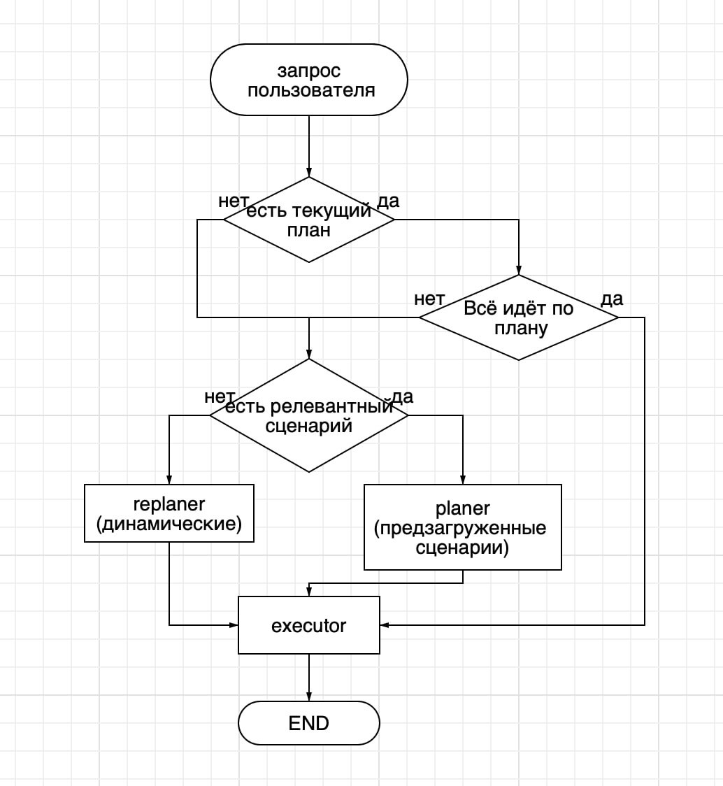
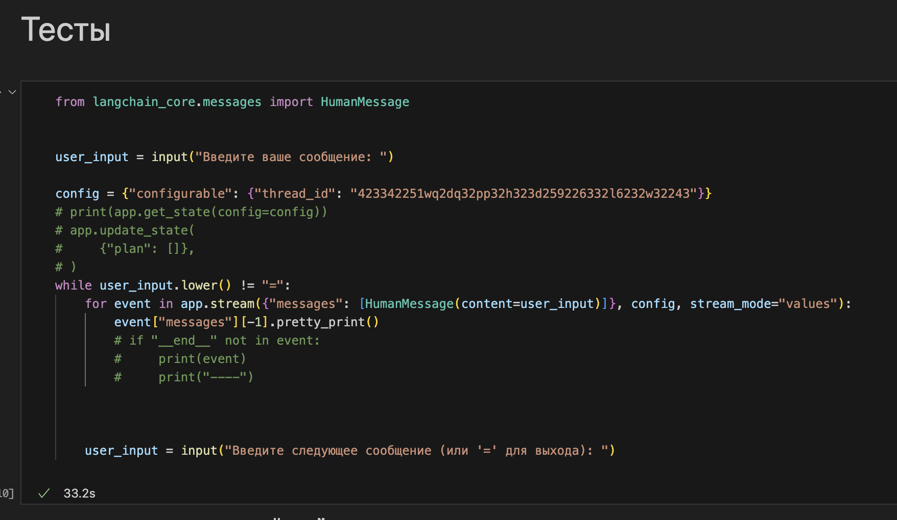

# Планировщик мультиагентной системы

Планировщик для мультиагентной системы, предназначенный для созданя плана на основании сценариев/функций.

# Схема работы



Объяснение:\
После запроса пользователя определяется есть ли текущий план в state графа(плана не будет только при первом запросе)\
Нет плана в state графа:\
На основании запроса ищется релевантный сценарий, если его нет agent - replaner составляет план на основании доступных функций. Если есть релевантный сценарий, то agent - planer составляет план на основании сценария.\
Есть план в state графа:\
Проверяется актуальность запроса для текущего плана\
Актуален:\
идём на агента исполнителя executor\
Не актуален:\
На основании запроса ищется релевантный сценарий, если его нет agent - replaner составляет план на основании доступных функций. Если есть релевантный сценарий, то agent - planer составляет план на основании сценария.

## Требования

Для работы с проектом вам нужно будет установить следующие зависимости:

- Python 3.12.3 или выше

## Установка и запуск

1. **Клонируйте репозиторий на вашу машину:**

   ```bash
   git clone https://github.com/KhristovG/planner.git  
   
2. **Создайте и активируйте виртуальное окружение:**
    ```bash
    python -m venv venv
    venv\Scripts\activate
3. **Установите зависимости из файла requirements.txt:**
    ```bash
    pip install -r requirements.txt
4. **Создайте файл .env для хранения конфиденциальных данных**

В корневой директории проекта создайте файл .env и добавьте в него ваш ключ API (если проект использует OpenAI API или другие сервисы):
OPENAI_API_KEY=ваш_ключ_от_OpenAI
Замените ваш_ключ_от_OpenAI на ваш реальный API-ключ от OpenAI или другого сервиса.


## Тестирование 
Доходим до этой ячейки ноутбука, тесты проводятся в ней. Чтобы выйти из диалога отправьте "=".
Необходимо вручную менять thread_id, если хотите перейти к новому диалогу. Один thread_id = 1 пользователь и соответствующая ему история.

